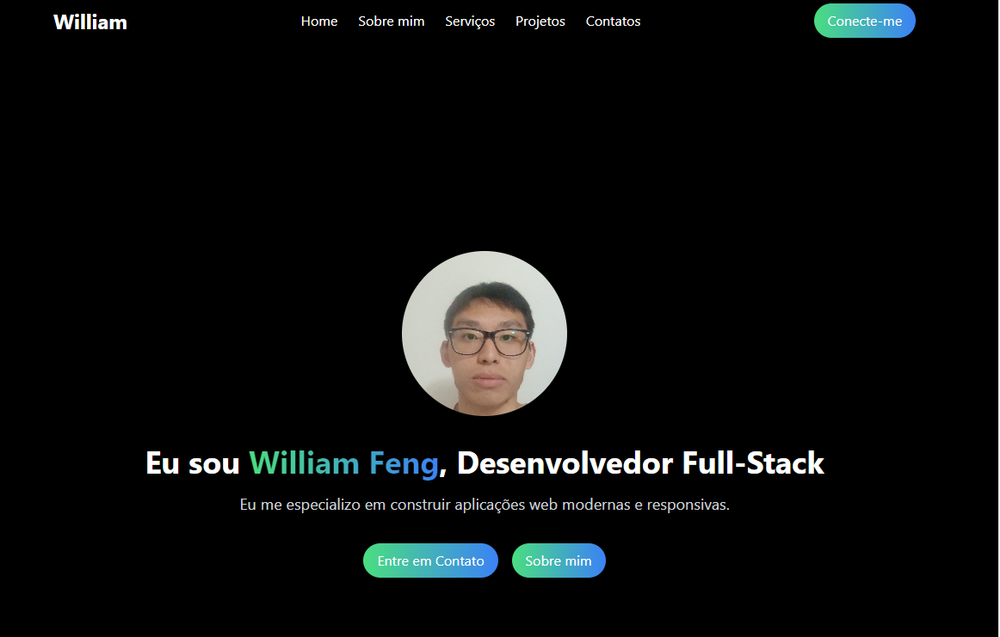

# Meu Portfólio

Bem-vindo ao meu portfólio! Aqui você encontrará uma coleção de projetos que desenvolvi, utilizando as mais recentes tecnologias e práticas de desenvolvimento.



## Descrição do Projeto

Este portfólio é uma vitrine dos meus trabalhos em desenvolvimento web, demonstrando minhas habilidades e experiências em várias áreas. O design é responsivo e foi otimizado para oferecer uma experiência de usuário fluida em dispositivos móveis e desktops.

## Tecnologias e Bibliotecas Utilizadas

- **React**: Biblioteca JavaScript para construir interfaces de usuário.
- **Tailwind CSS**: Framework CSS para estilização rápida e responsiva.
- **React Router**: Biblioteca para gerenciar rotas em aplicações React.
- **React Icons**: Biblioteca para ícones personalizáveis.

## Funcionalidades

- **Navegação por projetos**: Navegue pelos projetos desenvolvidos, visualizando detalhes e imagens.
- **Formulário de contato**: Entre em contato comigo para discutir oportunidades de trabalho ou colaboração.
- **Responsividade**: O portfólio é projetado para funcionar em dispositivos móveis e desktops.

## Como Executar o Projeto

1. Clone o repositório:
   ```bash
   git clone https://github.com/seu-usuario/seu-portifolio.git
